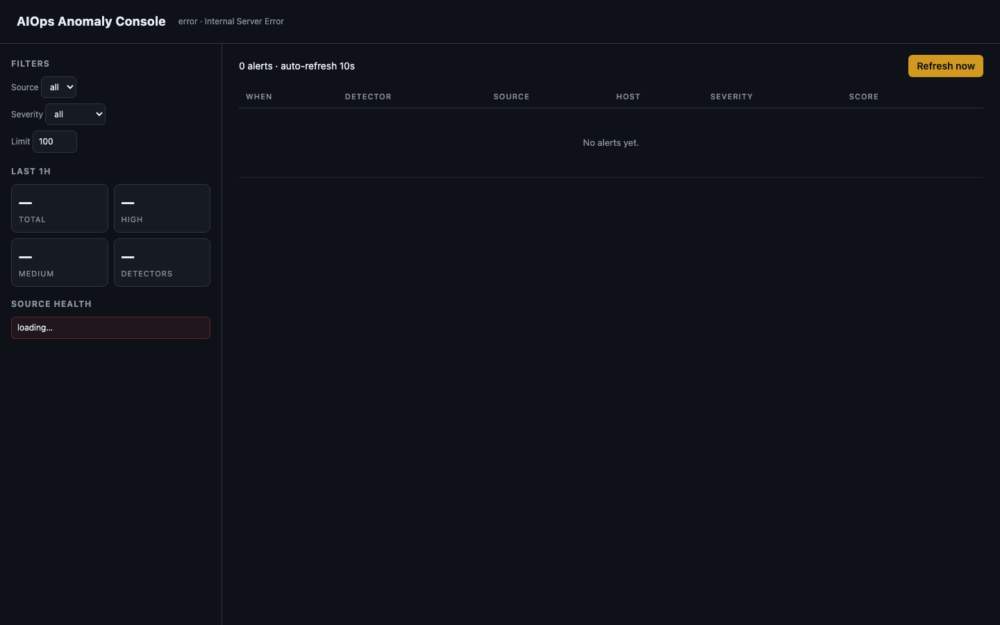
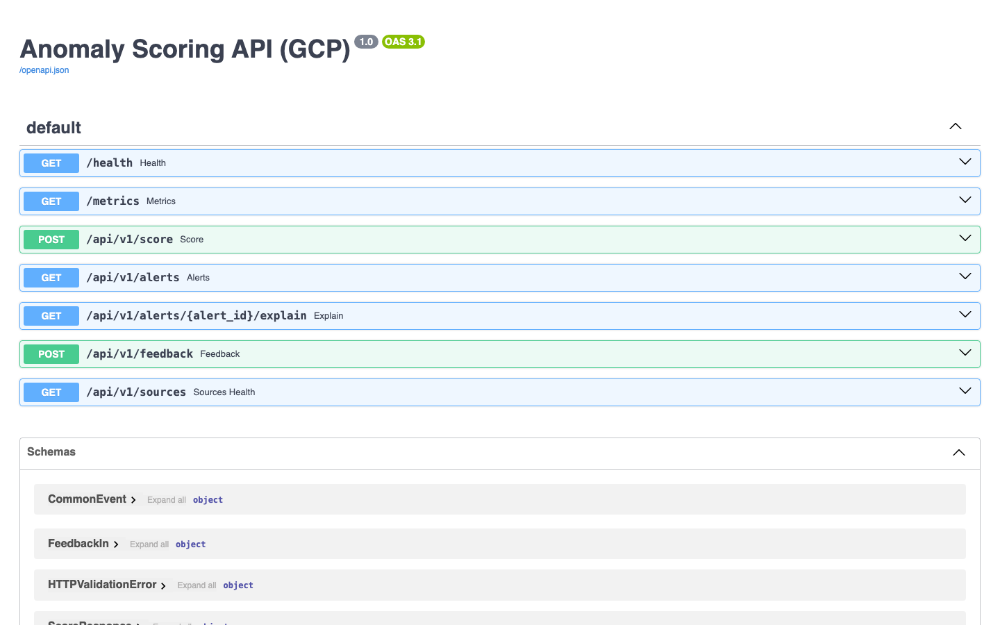

AIOps + MLOps + Security Analytics Platform (GCP port)

This file is the primary guide for Claude Code when working in this repository.
Read it before touching any code, running any command, or making any suggestion.

---

## Project Overview

End-to-end **AIOps / MLOps / Security Analytics platform on GCP** — sibling
of `../monitoring-mlops/` (AWS) and `../allen/GCP/math_bot/` (Vertex port).

Same problem: ingest logs, metrics, traces from across the stack and run
**anomaly / threat detection** with both cold-start streaming detectors and
trained ML detectors. Same tiered architecture. Different cloud primitives.

**Owner**: Akhil
**Cloud**: GCP (region `asia-south1` Mumbai)
**ML Orchestration**: Vertex AI Pipelines
**Streaming**: Pub/Sub + Dataflow
**Search/AD**: Elastic on GKE *or* BigQuery anomaly detection
**Metrics**: Google Cloud Managed Service for Prometheus (GMP) + Managed Grafana
**IaC**: Terraform
**Container Runtime**: GKE Autopilot (Kubernetes)

---

## Service Mapping (AWS → GCP)

| Concern | AWS | GCP |
|---|---|---|
| Object store | S3 | Cloud Storage (GCS) |
| Streaming ingest | Kinesis Firehose | Cloud Logging sink → Pub/Sub → Dataflow → GCS |
| Kafka | MSK | Confluent Cloud on GKE / GMK preview |
| Search + AD | OpenSearch | Elastic on GKE OR BigQuery `ML.DETECT_ANOMALIES` |
| ML pipelines | SageMaker Pipelines | Vertex AI Pipelines (KFP v2) |
| Model registry | SageMaker Model Registry | Vertex AI Model Registry |
| Online endpoint | SageMaker Endpoint | Vertex AI Endpoint |
| Streaming detector | Lambda + Kinesis trigger | Cloud Function Gen2 + Pub/Sub trigger |
| Container orch | EKS + IRSA | GKE Autopilot + Workload Identity |
| Logs | CloudWatch / FluentBit → S3 | Cloud Logging (default) + log sinks |
| Metrics | AMP / Managed Prometheus | Google Managed Prometheus (GMP) |
| Traces | X-Ray / OTEL | Cloud Trace (OTLP via OTEL collector) |
| Secrets | Secrets Manager | Secret Manager |
| Container registry | ECR | Artifact Registry |
| Cron | EventBridge cron | Cloud Scheduler → Pub/Sub |
| WAF | AWS WAF | Cloud Armor |
| Auth | Cognito | Identity Platform / IAP |
| GuardDuty | GuardDuty | Security Command Center (SCC) |

---

## Detection latency reality check

Identical to AWS port. Tiered detectors:

| Tier | Latency | What | Cold-start |
|---|---|---|---|
| **GCP-managed** | seconds | Security Command Center, Cloud Armor, Event Threat Detection | works immediately |
| **Streaming statistical** (Cloud Function) | seconds | z-score, EWMA, rate-of-change, threshold | ~30 min of data |
| **BigQuery ML.DETECT_ANOMALIES / Elastic AD** | minutes | RCF/ARIMA on indexed metrics | after detector init |
| **Vertex Pipelines + Endpoint** | hours train, ms inference | RCF, IForest, LSTM-AE, Log-BERT | needs ≥ 1-7 days |

---

## Repository Structure

```
monitoring-mlops-gcp/
├── CLAUDE.md
├── infra/                          ← Terraform (GCP) — root composes modules
│   ├── main.tf                     ← module orchestration + APIs + outputs
│   └── modules/
│       ├── datalake/               ← GCS partitioned + BigQuery dataset + 3 external/native tables  [present]
│       ├── streaming/              ← Pub/Sub topics + Dataflow PubSub→GCS flex job + 3 subscriptions [present]
│       ├── vertex/                 ← 4 Vertex AI Endpoints (rcf/iforest/lstm-ae/log-embedding)        [present]
│       ├── gke/                    ← GKE Autopilot + 3 Workload Identity bindings (scoring/otel/ui)  [present]
│       ├── database/               ← Cloud SQL Postgres + PSA peering                                [present]
│       ├── identity/               ← runner GSA + 13 IAM project roles                               [present]
│       ├── lb/                     ← Cloud Armor (rate-limit + SQLi/XSS WAF) + 2 static IPs          [present]
│       ├── monitoring/             ← 4 Cloud Scheduler retrain jobs + alert policy                   [present]
│       ├── grafana/                ← 2 google_monitoring_dashboard (AIOps Overview + Detector Health)[present]
│       └── registry/               ← Artifact Registry repo `monitoring-mlops`                       [present]
├── ml/
│   ├── parsers/                    ← Per-source log parsers → CommonEvent
│   ├── feature_engineering/        ← Sliding-window security features
│   ├── pipelines/                  ← Vertex Pipelines (4 detectors)
│   │   ├── rcf_metrics/
│   │   ├── iforest_logs/
│   │   ├── lstm_ae_traces/
│   │   └── log_embedding_anomaly/
│   ├── streaming/                  ← Cloud Function Gen2 (entry point: handler in detector.py)
│   ├── monitoring/                 ← Drift on detector inputs
│   └── inference/                  ← Local model loaders for tests
├── api/
│   ├── scoring/                    ← FastAPI: /score /alerts /explain /feedback /sources
│   └── ui/                         ← AIOps Anomaly Console (static + nginx proxy → scoring API)
├── helm/
│   └── charts/
│       ├── anomaly-scoring-api/    ← API on GKE (Ingress + Cloud Armor + PodMonitoring + HPA)
│       ├── aiops-ui/               ← Anomaly Console (Ingress + ManagedCertificate + Cloud Armor)
│       └── otel-collector/         ← OTLP receivers → Cloud Trace + GMP exporters
├── demo-app/                       ← Producer stack (web/api/worker + traffic-gen) — see demo-app/README.md
├── scripts/
│   ├── deploy_all.sh               ← interactive 9-stage end-to-end deploy
│   ├── seed_logs.py                ← synthetic events → Pub/Sub
│   ├── inject_attack.py            ← simulated DDoS / brute force
│   ├── teardown.sh
│   └── smoke_test.sh
├── tests/
└── docs/
    ├── DEPLOY.md
    └── MLOPS_GUIDE.md
```

---

## Layer Architecture

```
L1  Sources         CDN · LB · Cloud Armor · App · GKE · NGINX · Pub/Sub ·
                    Cloud SQL · MongoDB Atlas · Memorystore · Prom metrics · OTEL
L2  Ingestion       Cloud Logging sink → Pub/Sub → Dataflow → GCS · OTEL collector
L3  Lake / Index    GCS (raw partitioned per-source) · BigQuery external tables · Elastic
L4  Features        Vertex Processing → security_features (sliding windows)
L5  Detection       SCC / Cloud Armor + Cloud Function (streaming-stat) +
                    BigQuery ML.DETECT_ANOMALIES / Elastic AD + Vertex detectors
L6  Registry+Deploy Vertex Model Registry · Cloud Build · Vertex Endpoints · GKE
L7  Monitoring      Drift on detector inputs · Cloud Monitoring · Cloud Scheduler → retrain

APP  Scoring API    FastAPI on GKE · /score /alerts /explain /feedback /sources
APP  AIOps Console  Static UI on GKE (api/ui) — fronted by GCE Ingress + Cloud Armor at https://$DOMAIN_AIOPS
APP  Dashboards     Cloud Monitoring dashboards (modules/grafana) + BigQuery via Looker Studio (manual)
```

---

## End-to-end deploy

Single entry point: `scripts/deploy_all.sh`. Interactive, 9 stages, asks
[Y/n/s/q] before each. Caches Terraform outputs in `.deploy.env` so re-runs
work. Stages:

1. Platform Terraform (`infra/`) — GKE, GCS, Pub/Sub, BigQuery, Vertex, Cloud Armor, dashboards, scheduler
2. Build + push images (scoring-api, aiops-ui, 4 trainers, demo-app trio, sklearn re-tag)
3. Demo-app Terraform (`demo-app/infra/`) — Cloud SQL MySQL + Memorystore + WLI GSAs
4. Streaming Cloud Function (`gcloud functions deploy ... --source=ml/streaming --entry-point=handler`)
5. Seed events + run feature_engineering + submit 4 Vertex Pipelines
6. Attach trained models to the 4 pre-created Vertex Endpoints
7. Helm install: anomaly-scoring-api · aiops-ui · otel-collector
8. Helm install: demo-api · demo-worker · demo-web (creates `demo-api-db` k8s Secret from Secret Manager first)
9. `kubectl apply` traffic-gen CronJob + smoke test

End-state surfaces:
- `https://$DOMAIN_AIOPS`              — AIOps Anomaly Console (UI)
- `https://$DOMAIN_AIOPS/api/v1/alerts` — Scoring API JSON
- Cloud Monitoring → Dashboards         — "AIOps Overview" + "Detector Health"
- BigQuery dataset `monitoring`         — `raw_events`, `features_security`, `anomalies`
- Pub/Sub `*-anomalies-fanout`          — external anomaly consumers
- Cloud Trace                           — spans via OTEL collector

---

## Screenshots

### AIOps Anomaly Console (`aiops-ui`)

Dark-mode static UI on GKE, fronted by GCE Ingress + Cloud Armor. Filters
(source / severity / limit), 1h stat tiles (total / high / medium / detectors),
source-health strip, and a live alerts table auto-refreshed every 10s.



### Anomaly Scoring API (`anomaly-scoring-api`)

FastAPI on GKE. Serves `/health`, `/metrics`, and the `/api/v1/*` surface the UI
consumes. Swagger UI at `/docs`:



Routes:
| Method | Path                                | Purpose                                              |
|--------|-------------------------------------|------------------------------------------------------|
| GET    | `/health`                           | Liveness / readiness                                 |
| GET    | `/metrics`                          | Prometheus scrape (via GMP `PodMonitoring`)          |
| POST   | `/api/v1/score`                     | Fan out one CommonEvent to all 4 Vertex Endpoints    |
| GET    | `/api/v1/alerts?limit=`             | Recent anomalies (Firestore-backed)                  |
| GET    | `/api/v1/alerts/{id}/explain`       | Per-alert explanation payload                        |
| POST   | `/api/v1/feedback`                  | Analyst thumbs-up/down → labelling loop              |
| GET    | `/api/v1/sources`                   | Per-source health / event counts                     |

Note: `/score` requires ≥1 model attached to each Vertex Endpoint (Stage 6).
`/alerts` requires a Firestore native database in the project.

---

## Common schema (`ml/parsers/__init__.py::CommonEvent`)

Identical shape to AWS port — sources adapt to `cloudfront → cdn`, `alb → lb`,
`waf → cloud_armor`, `eks → gke`, `mysql → cloudsql`. Single `source` enum
covers both clouds so detectors are portable.

```python
{
    "ts": iso8601, "ingest_ts": iso8601,
    "source": "cdn|lb|cloud_armor|app|gke|nginx|cloudsql|mongo|redis|...",
    "host": str, "severity": "DEBUG|INFO|WARN|ERROR|CRITICAL|None",
    "status": int|None, "latency_ms": float|None, "bytes": int|None,
    "src_ip": str|None, "user": str|None, "path": str|None,
    "user_agent": str|None, "message": str, "attrs": dict,
}
```

---

## Detector specifications

Same four detectors as AWS port. GCP-specific details:

| Detector | Train infra | Serve infra | Gate |
|---|---|---|---|
| RCF Metrics | Vertex Custom (`n1-standard-4`, Spot) | Vertex Endpoint `n1-standard-2` | F1 ≥ 0.70 |
| Isolation Forest Logs | Vertex Custom (`n1-standard-4`, Spot) | Vertex Endpoint `n1-standard-2` | P@1% ≥ 0.80 |
| LSTM-AE Traces | Vertex Custom (`g2-standard-8` L4) | Vertex Endpoint `n1-standard-4` | AUC > 0.80 |
| Log-BERT Anomaly | Vertex Custom (`g2-standard-8` L4) | Vertex Endpoint `n1-standard-4` | P@1% ≥ 0.75 |

Streaming statistical detectors run as **Cloud Functions Gen2** triggered by
`anomaly-events` Pub/Sub subscription. Same rule shapes as AWS port
(z-score, EWMA, rate-of-change, threshold, distinct-counter).

---

## Critical Rules

1. **No PII**. Hash usernames + IPs (HMAC) before they leave the parser.
2. **Cost-aware**. `n1-standard-2` Endpoints in dev. Spot for all training.
   No GPU above L4. No A100/H100 in this project.
3. **Teardown order**: Vertex Endpoints → GKE scale-to-0 → Pub/Sub →
   Dataflow → Elastic → Cloud SQL stop → `terraform destroy`.
4. **All Terraform resources labelled** `project=monitoring-mlops-gcp`.
5. **Drift on detector inputs, not predictions**.
6. **Pipeline naming**: `{detector}-{environment}-pipeline`.
7. **Endpoint naming**: `{detector}-{environment}`.

---

## Sensitive Areas

1. `infra/modules/vertex/` — endpoint pool change drops detection coverage.
2. `ml/feature_engineering/security_features.py` — feature change invalidates
   baselines; retrain ALL detectors.
3. `ml/streaming/rules.yaml` — false positives drown on-call.
4. `infra/modules/identity/` — Workload Identity binding errors lock services
   out of GCS / Secret Manager.
5. `infra/modules/lb/` — Cloud Armor policy edits are public-blast-radius.
6. `infra/modules/datalake/` — BigQuery external table URI changes silently
   stop populating dashboards.
7. `infra/modules/streaming/` — Dataflow flex template name pinned to
   `Cloud_PubSub_to_GCS_Text`; verify before bumping region/version.
8. `helm/charts/aiops-ui/` — UI proxies `/api/*` to ClusterIP `anomaly-scoring-api:80`;
   renaming the scoring Service breaks the UI silently.
